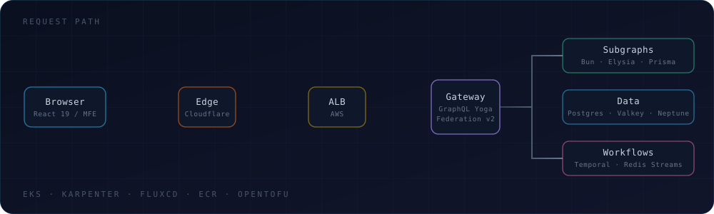

  

  
  
  
  

## 🧭 About

Full Stack Developer at **Burdenoff Consultancy Services**, working across the whole path a request takes — from a React micro-frontend, through a federated GraphQL edge, down to a managed AWS data tier.

- 🏗️ **Federated GraphQL** across dozens of subgraphs, with the composed supergraph served from a managed schema registry over CDN
- 🔐 **Multi-tenant B2B SaaS** with declarative, schema-driven authorization enforced centrally at the API gateway edge
- ☸️ **Kubernetes on AWS**, delivered GitOps-style — Git is the source of truth, the cluster reconciles itself
- 🧩 **Micro-frontends** composed at build time, sharing one design-token system
- 🔁 **CI → cloud without static keys**: GitHub OIDC federation to short-lived credentials, IRSA for in-cluster workload identity
- 📍 Tamil Nadu, India

## 🏛️ How a request flows

  

## 🛠️ Tech Stack

**Languages**

    

**Frontend**

        

**Backend & API**

         

**Data**

      

**Cloud & Infrastructure**

       

**DevOps & Platform**

        

**Observability & Testing**

      

## 🐍 Contribution graph

  <picture>
    <source media="(prefers-color-scheme: dark)" srcset="https://raw.githubusercontent.com/Riojaikumar/Riojaikumar/output/snake-dark.svg"/>
    <source media="(prefers-color-scheme: light)" srcset="https://raw.githubusercontent.com/Riojaikumar/Riojaikumar/output/snake-light.svg"/>
    
  </picture>

## 📊 GitHub Stats

  
  

  <i>"Build it so it tells you the truth when it breaks."</i>

